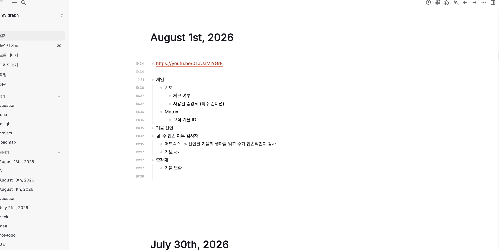

  

# Block Created Time

A small plugin for Logseq DB graphs that shows when each block was created.

Timestamps appear in a responsive column to the left of the journal in
`HH:mm` format.

The value comes from Logseq's built-in `:block/created-at` attribute. The
plugin never writes to the graph.

## How the badges are rendered

The plugin reads visible block elements from Logseq's DOM and adds timestamp
badges to a journal-level overlay. Each badge is positioned next to its block
with CSS, so nested blocks remain aligned in one left-hand column without
changing the block content. `MutationObserver` detects block changes, while
`ResizeObserver` and window resize events keep the badges aligned as the
layout changes.

## Requirements

- Logseq 2.0.1 or newer
- A DB graph
- Node.js 20.19 or newer when building from source

File graphs are not supported.
