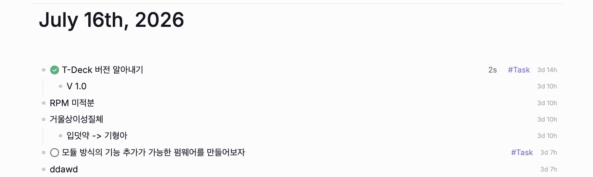

# Block Created Time

A small plugin for Logseq DB graphs that shows when each block was created.

Timestamps appear at the right edge of the block row in a compact `nd nh`
format.



The value comes from Logseq's built-in `:block/created-at` attribute. The
plugin never writes to the graph.

## Requirements

- Logseq 2.0.1 or newer
- A DB graph
- Node.js 20.19 or newer when building from source

File graphs are not supported.

## Install from source

```bash
npm install
npm run build
```

In Logseq, enable Developer mode and open the Plugins screen. Choose
**Load unpacked plugin**, then select this project directory.