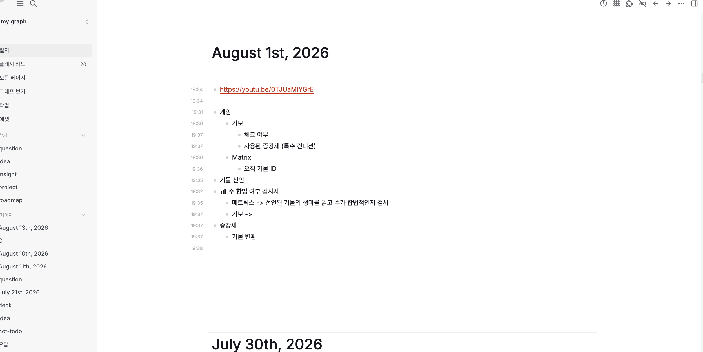

# Block Created Time
  

A small plugin for Logseq DB that shows when each block was created in journal page.

The value comes from Logseq's built-in `:block/created-at` attribute. The
plugin never writes to the graph.
